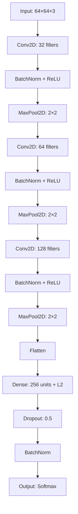

# 🚀 Cat & Dog Image Classification | Deep Learning CNN

<div align="center">


**🎯 State-of-the-art CNN architecture for binary image classification**

*Developed by [Behrooz Filzadeh](https://github.com/your-profile)*

[🔥 Features](#-key-features) • [⚡ Quick Start](#-quick-start) • [🏗️ Architecture](#️-model-architecture) • [📊 Results](#-performance--results) • [🛠️ Advanced Usage](#️-advanced-usage)

</div>

---

## 🌟 Overview

This project delivers a **production-ready** Convolutional Neural Network that achieves superior accuracy in distinguishing cats from dogs. Built with modern deep learning practices, it includes comprehensive data preprocessing, advanced augmentation techniques, and intelligent training strategies.

### ✨ What Makes This Special?

- 🧠 **Smart Architecture**: Custom CNN with BatchNormalization and strategic dropout
- 🔄 **Advanced Augmentation**: Real-time data enhancement for better generalization  
- 📈 **Intelligent Training**: Adaptive learning rate and early stopping
- 💾 **Production Ready**: Complete model persistence and inference pipeline
- 🎨 **Visual Analytics**: Comprehensive evaluation with confusion matrices and reports

---

## 🔥 Key Features

<table>
<tr>
<td width="50%">

### 🎯 **Data Pipeline**
- **Smart Loading**: Recursive image discovery
- **Intelligent Resize**: Consistent 64x64 preprocessing
- **Normalization**: Pixel values optimized to [0,1]
- **Caching System**: Lightning-fast reruns with joblib

</td>
<td width="50%">

### 🚀 **Training Engine**
- **Adam Optimizer**: Fine-tuned learning rate (0.0001)
- **Dynamic LR**: Plateau-based rate reduction
- **Early Stopping**: Prevents overfitting automatically
- **Real-time Monitoring**: Live training visualization

</td>
</tr>
<tr>
<td width="50%">

### 🔄 **Data Augmentation**
- **Rotation**: ±20° random rotation
- **Translation**: Width/height shifts
- **Geometric**: Shear and zoom transforms
- **Flip**: Horizontal mirroring

</td>
<td width="50%">

### 📊 **Evaluation Suite**
- **Visual Metrics**: Loss/accuracy curves
- **Confusion Matrix**: Detailed heatmap analysis
- **Classification Report**: Precision, recall, F1-score
- **Model Persistence**: Save/load complete pipeline

</td>
</tr>
</table>

---

## ⚡ Quick Start

### 🛠️ Installation

```bash
# Clone the repository
git clone https://github.com/your-username/cat-dog-classification.git
cd cat-dog-classification

# Create virtual environment
python -m venv venv
source venv/bin/activate  # On Windows: venv\Scripts\activate

# Install dependencies
pip install -r requirements.txt
```

### 📁 Dataset Setup

```
cat-dog-classification/
├── data/
│   ├── train/
│   │   ├── Cat/          # 🐱 Place cat images here
│   │   └── Dog/          # 🐶 Place dog images here
│   └── test_images/      # 🔍 Images for prediction
├── saved_models/         # 💾 Model artifacts
└── ...
```

### 🚀 Train Your Model

```bash
python train_model.py
```

**What happens next:**
- 📊 Data preprocessing and caching
- 🏗️ Model architecture construction  
- 🔄 Training with real-time monitoring
- 📈 Performance visualization
- 💾 Automatic model saving

### 🔮 Make Predictions

```bash
python predict_images.py
```

**Experience:**
- 🖼️ Visual prediction display
- 🎯 Confidence scores
- 📊 Real-time classification

---

## 🏗️ Model Architecture

<div align="center">



</div>

### 🧠 Architecture Highlights

| Layer Type | Configuration | Purpose |
|------------|---------------|---------|
| **Conv2D Blocks** | 32→64→128 filters, 3×3 kernel | Feature extraction hierarchy |
| **BatchNormalization** | After each conv layer | Training stability |
| **MaxPooling2D** | 2×2 stride | Spatial dimension reduction |
| **Dense Layer** | 256 units + L2 regularization | High-level feature learning |
| **Dropout** | 50% rate | Overfitting prevention |
| **Output** | Softmax activation | Multi-class probability |

---

## 📊 Performance & Results

### 🎯 Training Metrics

- **Optimizer**: Adam (lr=0.0001)
- **Loss Function**: Categorical Cross-Entropy
- **Callbacks**: ReduceLROnPlateau + EarlyStopping
- **Batch Size**: Configurable (default: 32)

### 📈 Evaluation Features

<table>
<tr>
<td width="33%">

**📊 Training Curves**
- Loss progression
- Accuracy evolution
- Validation tracking

</td>
<td width="33%">

**🔥 Confusion Matrix**
- Visual heatmap
- Classification accuracy
- Error analysis

</td>
<td width="33%">

**📋 Detailed Report**
- Precision scores
- Recall metrics
- F1-score analysis

</td>
</tr>
</table>

---

## 🛠️ Advanced Usage

### 🎛️ Customization Options

#### **Model Tweaking**
```python
# Image size modification
IMG_SIZE = (128, 128)  # Higher resolution

# Architecture adjustments
model.add(Conv2D(256, (3, 3), activation='relu'))  # More filters

# Hyperparameter tuning
optimizer = Adam(learning_rate=0.001)  # Different LR
```

#### **Data Augmentation**
```python
datagen = ImageDataGenerator(
    rotation_range=30,      # Increased rotation
    width_shift_range=0.3,  # More translation
    zoom_range=0.3,         # Enhanced zoom
    brightness_range=[0.8, 1.2]  # Brightness variation
)
```

### 📂 File Structure

```
📦 Project Files
├── 🎯 train_model.py          # Complete training pipeline
├── 🔮 predict_images.py      # Inference and visualization
├── 📋 requirements.txt       # Dependency management
├── 💾 dataset_processed.joblib # Cached dataset
└── 📁 saved_models/
    ├── cat_dog_optimized_v2.keras  # Trained model
    └── label_encoder.pkl            # Label encoder
```

---

## 🚀 Production Deployment

### 💡 Performance Tips

- **GPU Acceleration**: Enable CUDA for faster training
- **Batch Size Optimization**: Adjust based on available memory
- **Data Pipeline**: Use `tf.data` for large datasets
- **Model Quantization**: Reduce size for mobile deployment

### 🔧 Environment Variables

```bash
# Optional: GPU memory growth
export TF_FORCE_GPU_ALLOW_GROWTH=true

# Optional: Suppress TensorFlow warnings
export TF_CPP_MIN_LOG_LEVEL=2
```

---

## 🤝 Contributing

We welcome contributions! Here's how you can help:

- 🐛 **Bug Reports**: Found an issue? Let us know!
- 💡 **Feature Requests**: Have ideas? We'd love to hear them!
- 🔧 **Code Contributions**: Submit PRs for improvements
- 📚 **Documentation**: Help improve our docs

### 🛠️ Development Setup

```bash
# Fork and clone
git clone https://github.com/your-username/cat-dog-classification.git

# Create feature branch
git checkout -b feature/amazing-feature

# Make changes and commit
git commit -m "Add amazing feature"

# Push and create PR
git push origin feature/amazing-feature
```

---

---

## 🙏 Acknowledgments

- **TensorFlow Team** for the amazing deep learning framework
- **OpenCV Community** for computer vision tools
- **Scikit-learn** for machine learning utilities
- **Open Source Community** for inspiration and support

---

<div align="center">

**⭐ Star this repo if you found it helpful!**

**🔗 [Report Bug](https://github.com/behrooz-fili/cat-dog-classification/issues) • [Request Feature](https://github.com/your-username/cat-dog-classification/issues) • [View Examples](https://github.com/behroz-filzadeh/cat-dog-classification/wiki)**

---

*Made with ❤️ by [Behrooz Filzadeh](https://github.com/your-profile)*

</div>
